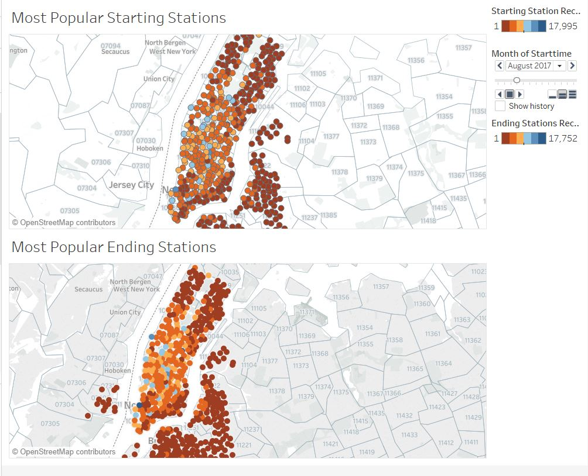
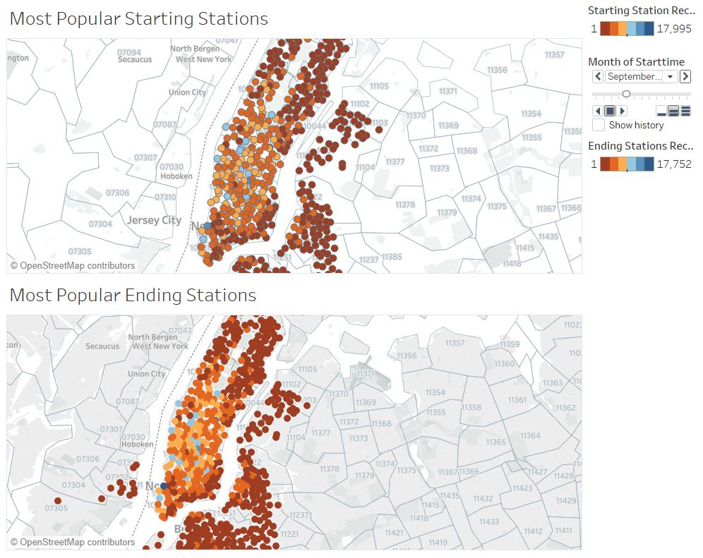

# CitiBike-Tableau

## Data Preparation
This project analyzes the [New York Citi Bike](https://en.wikipedia.org/wiki/Citi_Bike) Program. I downloaded all files from [CitiBike Trip Data](https://s3.amazonaws.com/tripdata/index.html). The latest data available as of July 2018 was trip data for May 2018. In order to capture the latest and most relevant data, I looked at the latest year's data from May 2017 to May 2018 (from 201705-citibike-tripdata.csv.zip to 201805-citibike-tripdata.csv.zip). 

Since all columns were the same, I created a union with all twelve csvs in Tableau Desktop. Other ways this could have been accomplished are by using Python's Pandas library to merge all CSVs into one file or using any Relational Database, such as SQL Server, to import the CSV files and export the output into a CSV file. 

## Visualizations and Analysis 

### Dashboard Station's Popularity Changes Over Time
This project focused on NYC Citibike Stations from May 2017 to May 2018. Tableau's page feature was used for time series analysis. Starting from September 2017 onwards, there were more riders in 11106, 11102 and 11103 zipcodes, Long Island City|Queens neighborhood. (There were no riders from May 2017 to August 2017 in these zip codes). The number of riders in this area has increased over time. 
Before this time period, there were more riders in the East Village,Downtown, Manhattan area of NYC. Since September 2017, the amount of riders has decreased in this area. 

### Others

* How many trips have been recorded total during the chosen period?
* By what percentage has total ridership grown? 